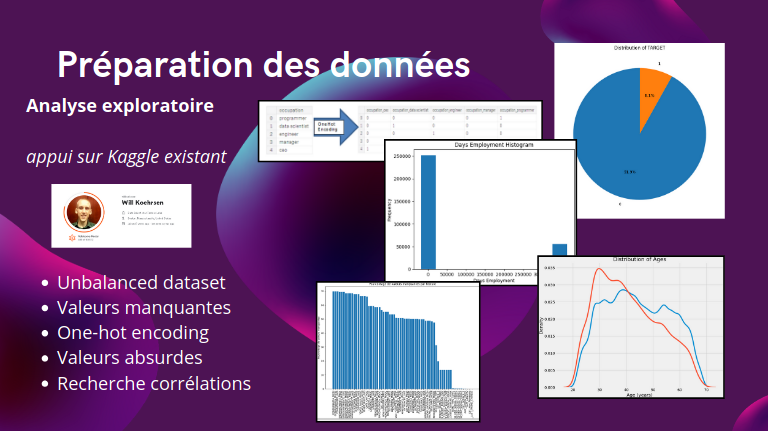

# Implémentation d'un Modèle de Scoring

  

## Contexte

En tant que Data Scientist chez **Prêt à dépenser**, une société financière spécialisée dans les crédits à la consommation, j'ai été chargé de développer un modèle de scoring pour évaluer la probabilité de remboursement des prêts par les clients. Ce modèle permettra de classifier automatiquement les demandes de crédit en tant qu'approuvées ou refusées, en se basant sur des données variées telles que les comportements des clients et les informations provenant d'autres institutions financières.

## Objectif du Projet

Le projet vise à :
1. **Élaboration du Modèle de Scoring** : Construire un modèle de machine learning capable de prédire la probabilité de défaut de paiement d'un client et de classifier sa demande de crédit.
2. **MLOps et Mise en Production** : Déployer le modèle de scoring sous forme d'une API dans le cloud, gérer son cycle de vie via une approche MLOps, et surveiller les performances en production.

## Étapes de l'Analyse

1. **Prétraitement et Feature Engineering** :
    - Préparation des données, gestion des variables catégorielles et création de nouvelles variables.
    - Transformation des distributions de variables et normalisation lorsque nécessaire.

2. **Modélisation et Évaluation** :
    - Sélection et entraînement de plusieurs modèles de machine learning.
    - Optimisation des hyperparamètres via validation croisée et évaluation des performances des modèles selon des critères techniques (AUC, accuracy) et métier (minimisation des coûts d'erreur).

3. **Suivi du Cycle de Vie du Modèle (MLOps)** :
    - Utilisation de MLFlow pour le suivi des expérimentations, le stockage des modèles et la gestion de leur déploiement.
    - Mise en œuvre d'un pipeline CI/CD pour automatiser le déploiement de l'API sur le cloud avec GitHub Actions.

4. **Détection du Data Drift** :
    - Utilisation de la librairie evidently pour détecter les éventuels drifts des données en production et maintenir la performance du modèle.

## Livrables

- **API de Prédiction du Score** : API déployée sur le cloud permettant de prédire la probabilité de défaut et la classification des demandes de crédit.
- **Notebook de Modélisation** : Contient l'ensemble des étapes de prétraitement, de modélisation, et de tracking via MLFlow.
- **Dossier de Code Versionné** : Géré via Git, ce dossier contient le code de la modélisation, du déploiement de l'API, et un fichier expliquant l'objectif du projet et l'organisation du code.
- **Tableau HTML d'Analyse de Data Drift** : Produit avec evidently pour détecter les éventuels drifts entre les données d'entraînement et de production.
- **Interface de Test de l'API** : Un notebook ou une application Streamlit permettant de tester localement l'API de prédiction.
- **Support de Présentation** : Présentation de 30 slides maximum détaillant l'ensemble du travail réalisé, incluant des copies d'écran et des preuves du déploiement continu de l'API.

## Soutenance

La soutenance repose sur le livrable de présentation et couvre les éléments suivants :
- Rappel de la problématique et présentation du jeu de données.
- Explication de la modélisation, visualisation du tracking via MLFlow, et analyse des résultats.
- Présentation du pipeline de déploiement, du suivi des performances en production, et de la gestion du data drift.
- Démonstration de l'API en production avec un exemple de scoring client.

### Visionner la Soutenance

Vous pouvez visionner l'enregistrement de la soutenance à l'adresse suivante : [Lien vers la vidéo](https://youtu.be/yqOGjucv_5s?si=JSaFdt1yTHmqzvGd).

## Contact

Pour plus d'informations sur moi ou pour accéder à mes coordonnées, veuillez visiter mon site web : [alexandre.rogues.fr](https://alexandre.rogues.fr).

Merci de l'intérêt que vous portez à ce projet !

